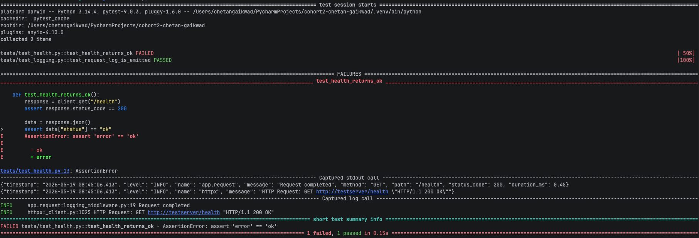
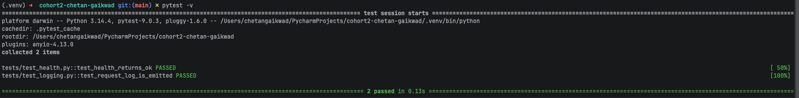

# Test-Break-Fix Cycle: `/health` Endpoint

## What was changed

In commit [`d5adc3d`](../../commit/d5adc3d), the health endpoint response was intentionally broken by changing the status value from `"ok"` to `"error"` in `app/routes/health.py`:

```diff
- status="ok",
+ status="error",
```

## Test output screenshots

### Failure (after the intentional break)



`test_health_returns_ok` failed with:

```
AssertionError: assert 'error' == 'ok'
```

`test_request_log_is_emitted` continued to pass — it only validates logging behaviour, not response content.

### Fix (after reverting the change)



Both tests passed in 0.13s after the fix in commit [`47fb7ec`](../../commit/47fb7ec).

## Sample `/health` response (after fix)

```json
{
  "status": "ok",
  "timestamp": "2026-05-19T03:30:00.000000Z",
  "version": "0.1.0",
  "environment": "development"
}
```

## Failure drill: before / after

| Aspect            | Before (broken)                          | After (fixed)                          |
|-------------------|------------------------------------------|----------------------------------------|
| **Commit**        | `d5adc3d` — Intentionally failed test    | `47fb7ec` — Test fixed                 |
| **Code change**   | `status="error"`                         | `status="ok"`                          |
| **Test result**   | 1 failed, 1 passed                       | 2 passed                               |
| **Failure type**  | `AssertionError: 'error' == 'ok'`        | —                                      |
| **File modified** | `app/routes/health.py`                   | `app/routes/health.py`                 |

## Reflection

This drill confirmed that the existing test suite catches even a single-field value change immediately — `test_health_returns_ok` pinpointed the exact mismatch (`'error' == 'ok'`) within seconds. It also showed good test isolation: the logging test was unaffected because it validates request metadata, not response content. The exercise reinforces that small, focused assertions make failures easy to diagnose — the pytest output pointed directly at the broken line, leaving no guesswork about what went wrong or how to fix it.
